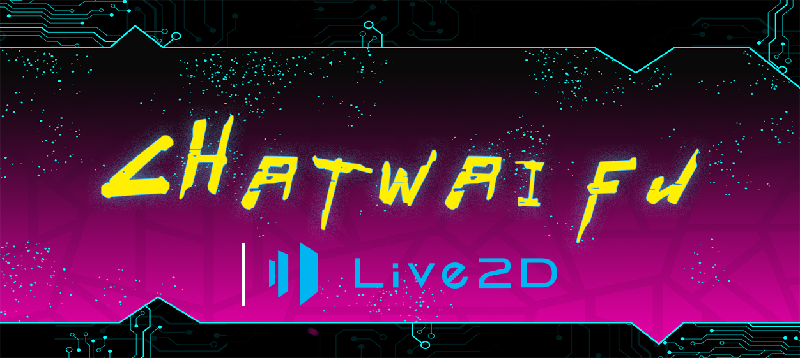

[中文](README.md "中文") [English](eng-README.md "English") [日本語](jp-README.md "日本語")

	
	
  	

#

> ### This is a chatting Waifu program use VITS & ChatGPT!

Effect demonstration on BiliBIli:[《青春猪头少年不会梦见赛博女友》](https://www.bilibili.com/video/BV1rv4y1Q7eT "BiliBili")

**Supported Aspects:**
* [x] Talking with ChatGPT
* [x] Convert AI's Response to wav file
* [x] Multi-Character voice generator
* [x] Voice Recognition
* [x] L2D Enabled UI
* [x] [Connect to Marai Robort](https://github.com/MuBai-He/ChatWaifu-marai)

# Usage
#### Make sure that you are using chrome explorer and have the newest version108 installed
#### If you are in China Mainland or Russia, a VPN connection is required
#### donload and decompress the newest Release
#### run the exe file to install the program, we recommand you to install in a folder outside C:\\
#### Run ChatWaifuServer.exe
#### Run ChatWaifu.exe under ChatWaifuL2D/Game

# How to get Token
#### Log in to ChatGPT whith link:https://chat.openai.com
#### Press F12 to enter command center
#### Find Application -> cookie -> __Secure-next-auth.session-token

#### Copy the value into game and press ENTER

## 6.Special Thanks：
- [MoeGoe_GUI]https://github.com/CjangCjengh/MoeGoe_GUI
- [Pretrained models]https://github.com/CjangCjengh/TTSModels
- [PyChatGPT]https://github.com/terry3041/pyChatGPT
